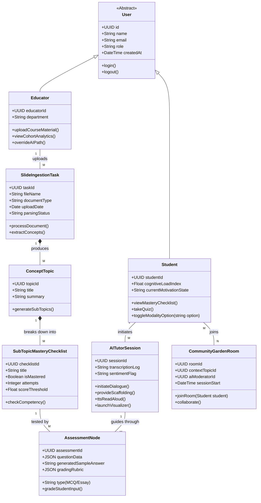

# Domain Modeling
**Project:** AI-Enhanced STEM Education App

## 1. Introduction
This document defines the underlying entities, behaviors, and relationships required to support the complex data architecture of the application. The system integrates standard user management alongside intricate graph-based educational paths and AI interaction logging.

## 2. UML Entity Relationship Diagram (Class Diagram)

Below is the Mermaid class diagram showcasing domains starting from users (Students/Educators) down to granular AI generated nodes (Quizzes, Checklists) based on slide ingestions.

## 3. Key Domain Entities Description

### 3.1 Slide Ingestion Entity (`SlideIngestionTask`)
This runs an internal state machine (Uploaded $\rightarrow$ Vectorizing $\rightarrow$ Synthesizing $\rightarrow$ Ready). Once parsed, the AI populates an aggregate of `ConceptTopic` objects mapping directly to what the teacher taught.

### 3.2 Dynamic Mastery Engine (`SubTopicMasteryChecklist`)
Rather than a traditional standard 'course', the mastery checklist is a self-adjusting node. As a `Student` interacts with an `AssessmentNode`, the AI updates `isMastered`. If `attempts` rise dramatically without success, a trigger invokes the AI to scaffold backward, decreasing the local `cognitiveLoadIndex`.

### 3.3 The UI "Modality" Methods (`toggleModalityOption`)
Under the `Student` domain, functions like `ttsReadAloud()` or `launchVisualizer()` belong natively inside the `AITutorSession`. This represents the on-demand context-switching capability (clicking the speaker icon). The state represents how the AI is responding to the user continuously, not just what preference they picked at the start.

### 3.4 Community Garden Entity (`CommunityGardenRoom`)
A temporary matching environment that requires an intersection between a `Student` seeking help, a `Student` available to help, and a shared `contextTopicId` from the Mastery Checklist. This ensures that peer-to-peer relationships are highly relevant to the active context curve.
