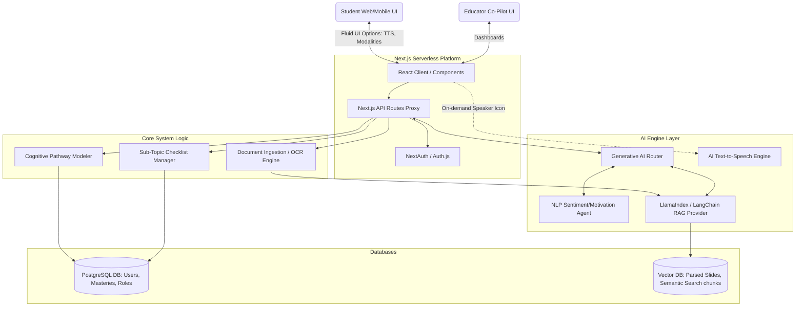

# System Specification & Architecture
**Project:** AI-Enhanced STEM Education App

## 1. Introduction
The System Specification establishes the physical software architecture, data flow pipelines, and technical integration of the Next.js stack with modern AI tooling (LLMs, Vector Databases, Cognitive Modeling services).

## 2. High-Level Architecture View

The system follows a typical modern Serverless Microservices pattern adapted for Heavy AI computational loads. Because the workspace utilizes Next.js natively, we treat Next.js as the primary aggregation tier (BFF - Backend For Frontend).

## 3. Subsystem Breakdown

### 3.1 Next.js React Client (Frontend)
*   **Split-Pane Workspace Component:** Built using pure React state to ensure seamless data flow. The left pane renders the uploaded PDF/text; the right pane maps dynamically generated React forms (Quizzes, Essay boxes).
*   **Contextual Modality Toggles:** 
    *   Stateful hooks (`useAudioPlayer`, `useARVisualizer`) listen to text highlighting. When a student presses the 'Speaker' icon on highlighted text, it queues an API call to the TTS engine and plays audio locally via the Browser Audio API.

### 3.2 Document Ingestion Pipeline
*   **Trigger:** User uploads `.pdf` or `.pptx` via Next.js server actions.
*   **Process:** 
    1.  File is handed to an OCR parser (e.g., Python microservice or Node-compatible PDF parser like `pdf-parse`).
    2.  Text is chunked into logical pedagogical blocks (topics/sub-topics).
    3.  A lightweight LLM call creates a meta-description of the slide deck (Extracting the Concept Mastery Checklist).
    4.  Extracts are vectorized into the VectorDB for hyper-relevant quiz mapping.

### 3.3 AI Cognitive & Agent Pipeline
*   **Generative Evaluator (Agent 1):** Scans the student's text/code/math answers. Instead of returning `True/False`, it streams back graded rubrics and Socratic questions to encourage self-correction.
*   **Sentiment Motivator (Agent 2):** Periodically runs NLP over the conversational chat logs. If negative markers ("I hate this", "I don't understand") appear, it flags the `MasteryManager` to alter the cognitive load (present an easier question, deploy visual graphs instead of variables) and responds empathetically.

### 3.4 Community Garden "Matchmaking" Socket
*   Utilizes WebSockets to hook students learning the exact same vector chunk (same sub-topic derived from the slide context). Connects them into a synchronous multiplayer room where AI acts safely as the room moderator, nudging the dual-student collaboration forward.

## 4. Integration Specifications

### 4.1 RAG Architecture For Assessments
*   The system uses Retrieval-Augmented Generation to generate test assets.
*   *Prompt logic:* `Given Context A (from User Slide), generate 5 MCQs and 1 Essay Prompt to test the understanding of Sub-Concept B. Format as strict internal JSON for the Next.js component to map into forms.`
*   The generated JSON includes: Questions, Sub-topic Mapping Identifiers, Perfect Outline Answers, Grading Logic.

### 4.2 Security Boundaries
*   All ingested documents are hashed with a Tenant-ID (User/Class ID) inside the Vector database so Student A's AI cannot inadvertently access Student B's uploaded physics quiz notes unless explicitly designated to a Community Room.
